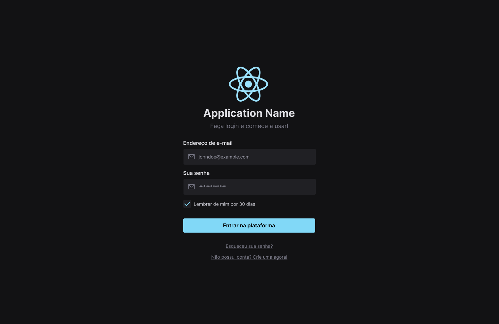

import { Meta } from "@storybook/addon-docs";

<Meta title="Introduction" />

# Ignite Lab Design System

Projeto desenvolvido durante o Ignite Lab da Rocketseat (de 10 à 13 de outubro de 2022) usando as tecnologias:

- Vite
- ReactJS
- TypeScript
- Tailwind CSS
- Radix UI / clsx
- Phosphor Icons
- Axios
- Formik / Yup
- StoryBook
  - Jest
  - testing-library
  - test-runner
  - MSW

## Preview

